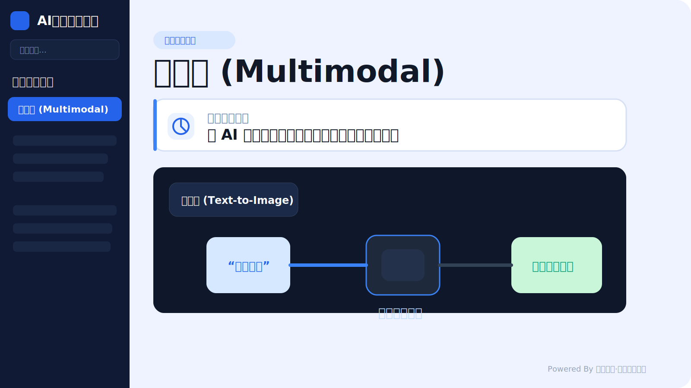

# AI百科全书

面向内部培训、快速查阅和统一口径的 AI 术语百科项目。它基于 `React + Vite` 构建，把常见 AI 概念、关键词关系和场景化解释整理成一套可搜索、可浏览、可演示的知识入口，适合用于分享、培训和日常检索。



## 项目亮点

- 以中文语境组织 AI 术语，适合内部培训和业务交流
- 支持分类浏览与关键词搜索，快速定位核心概念
- 页面结构清晰，适合直接作为演示站点或知识库首页
- 支持本地开发、静态构建与 Docker 部署

## 技术栈

- React 19
- TypeScript
- Vite
- Tailwind CSS
- Motion
- Lucide React

## 本地启动

### 环境要求

- Node.js 20+
- npm

### 安装依赖

```bash
npm install
```

### 配置环境变量

在项目根目录创建 `.env.local`，并填写：

```env
GEMINI_API_KEY=your_gemini_api_key
```

示例配置可参考 [`.env.example`](./.env.example)。

### 启动开发环境

```bash
npm run dev
```

默认访问地址：

```text
http://localhost:3000
```

## 生产构建

```bash
npm run build
```

构建完成后会生成 `dist` 目录。

## Docker 部署

### 构建镜像

```bash
docker build -t harbor.tsingyun.net/platform/ai-terminology-encyclopedia:1.0 .
```

### 启动容器

```bash
docker run -d \
  --name ai-terminology-encyclopedia \
  --restart unless-stopped \
  -p 8082:8082 \
  harbor.tsingyun.net/platform/ai-terminology-encyclopedia:1.0
```

启动后访问：

```text
http://<server-ip>:8082
```

## 适用场景

- 新同事入门 AI 基础概念
- 内部分享时统一术语口径
- 业务同学快速理解常见 AI 能力边界
- 展示 AI 关键词地图与术语关系

## 注意事项

- 不要提交 `.env`、`.env.local` 等环境变量文件
- 当前方案会在前端构建阶段注入 `GEMINI_API_KEY`，若用于公网环境，建议改为后端代理调用
- 若需要更完善的线上能力，可进一步补充后台管理、内容维护与 CI/CD
